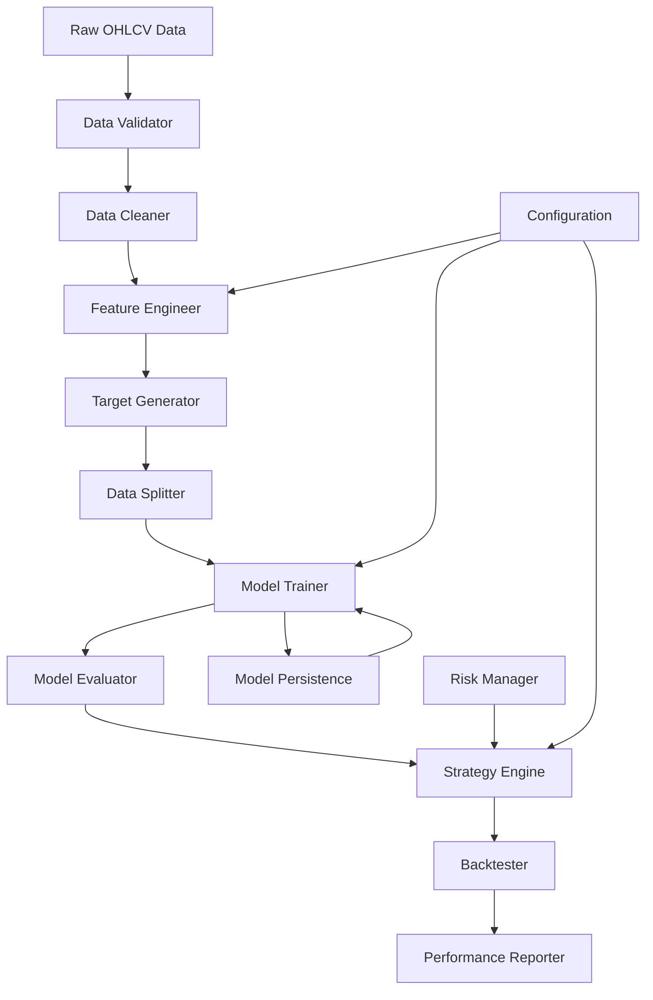

# Design Document

## Overview

The Intraday XGBoost Trading Strategy system is designed as a modular, extensible framework that combines machine learning with quantitative trading. The architecture follows a pipeline pattern where data flows through distinct stages: acquisition, preprocessing, feature engineering, model training, prediction, and backtesting. The system emphasizes time-series integrity, avoiding look-ahead bias, and implementing robust risk management.

The core design philosophy centers on:
- **Modularity**: Each component can be developed, tested, and maintained independently
- **Time-series integrity**: All operations respect temporal ordering to prevent data leakage
- **Configurability**: Parameters and strategies can be easily adjusted without code changes
- **Extensibility**: New features, indicators, and models can be added seamlessly
- **Risk-first approach**: Risk management is built into every trading decision

## Architecture

The system follows a layered architecture with clear separation of concerns:

```
┌─────────────────────────────────────────────────────────────┐
│                    Application Layer                        │
│  ┌─────────────────┐  ┌─────────────────┐  ┌─────────────┐ │
│  │   CLI Interface │  │  Config Manager │  │   Logger    │ │
│  └─────────────────┘  └─────────────────┘  └─────────────┘ │
└─────────────────────────────────────────────────────────────┘
┌─────────────────────────────────────────────────────────────┐
│                     Strategy Layer                          │
│  ┌─────────────────┐  ┌─────────────────┐  ┌─────────────┐ │
│  │ Strategy Engine │  │ Signal Generator│  │ Risk Manager│ │
│  └─────────────────┘  └─────────────────┘  └─────────────┘ │
└─────────────────────────────────────────────────────────────┘
┌─────────────────────────────────────────────────────────────┐
│                   Machine Learning Layer                    │
│  ┌─────────────────┐  ┌─────────────────┐  ┌─────────────┐ │
│  │ Model Trainer   │  │ Feature Engineer│  │ Predictor   │ │
│  └─────────────────┘  └─────────────────┘  └─────────────┘ │
└─────────────────────────────────────────────────────────────┘
┌─────────────────────────────────────────────────────────────┐
│                      Data Layer                             │
│  ┌─────────────────┐  ┌─────────────────┐  ┌─────────────┐ │
│  │ Data Loader     │  │ Data Validator  │  │ Data Store  │ │
│  └─────────────────┘  └─────────────────┘  └─────────────┘ │
└─────────────────────────────────────────────────────────────┘
```

### Data Flow Architecture



## Components and Interfaces

### 1. Data Management Components

#### DataLoader
```python
class DataLoader:
    def load_ohlcv_data(self, symbol: str, timeframe: str, start_date: datetime, end_date: datetime) -> pd.DataFrame
    def validate_data_integrity(self, data: pd.DataFrame) -> ValidationResult
    def clean_data(self, data: pd.DataFrame) -> pd.DataFrame
```

**Responsibilities:**
- Load financial data from various sources (CSV, API, database)
- Validate data completeness and consistency
- Handle missing values and outliers
- Ensure proper datetime indexing

#### DataValidator
```python
class DataValidator:
    def check_completeness(self, data: pd.DataFrame) -> bool
    def detect_outliers(self, data: pd.DataFrame) -> List[int]
    def validate_ohlcv_consistency(self, data: pd.DataFrame) -> ValidationResult
```

### 2. Feature Engineering Components

#### FeatureEngineer
```python
class FeatureEngineer:
    def __init__(self, config: FeatureConfig)
    def add_trend_indicators(self, data: pd.DataFrame) -> pd.DataFrame
    def add_momentum_indicators(self, data: pd.DataFrame) -> pd.DataFrame
    def add_volatility_indicators(self, data: pd.DataFrame) -> pd.DataFrame
    def add_volume_indicators(self, data: pd.DataFrame) -> pd.DataFrame
    def create_features(self, data: pd.DataFrame) -> pd.DataFrame
```

**Technical Indicators Implementation:**
- **Trend Indicators**: SMA (20, 50, 200), EMA (12, 26, 50)
- **Momentum Indicators**: RSI (14), MACD (12, 26, 9), Stochastic
- **Volatility Indicators**: Bollinger Bands (20, 2), ATR (14), Volatility Ratio
- **Volume Indicators**: OBV, Volume SMA, Volume Rate of Change

#### TargetGenerator
```python
class TargetGenerator:
    def create_binary_target(self, data: pd.DataFrame, lookahead: int = 1) -> pd.DataFrame
    def create_multiclass_target(self, data: pd.DataFrame, thresholds: List[float]) -> pd.DataFrame
    def create_regression_target(self, data: pd.DataFrame, horizon: int) -> pd.DataFrame
```

### 3. Machine Learning Components

#### ModelTrainer
```python
class ModelTrainer:
    def __init__(self, config: ModelConfig)
    def prepare_data(self, data: pd.DataFrame) -> Tuple[np.ndarray, np.ndarray]
    def split_data_chronologically(self, X: np.ndarray, y: np.ndarray, test_size: float) -> DataSplit
    def tune_hyperparameters(self, X_train: np.ndarray, y_train: np.ndarray) -> Dict
    def train_model(self, X_train: np.ndarray, y_train: np.ndarray, params: Dict) -> XGBClassifier
    def evaluate_model(self, model: XGBClassifier, X_test: np.ndarray, y_test: np.ndarray) -> ModelMetrics
```

**Hyperparameter Tuning Strategy:**
- Use TimeSeriesSplit for cross-validation to prevent look-ahead bias
- Grid search over key parameters: max_depth, learning_rate, n_estimators, gamma, subsample
- Early stopping to prevent overfitting
- Feature importance analysis for model interpretability

#### Predictor
```python
class Predictor:
    def __init__(self, model: XGBClassifier, feature_engineer: FeatureEngineer)
    def predict_signal(self, current_data: pd.DataFrame) -> TradingSignal
    def predict_probability(self, current_data: pd.DataFrame) -> float
    def get_feature_importance(self) -> Dict[str, float]
```

### 4. Trading Strategy Components

#### StrategyEngine
```python
class StrategyEngine(Strategy):  # Inherits from backtesting.py Strategy
    def __init__(self, predictor: Predictor, risk_manager: RiskManager)
    def init(self)
    def next(self)
    def generate_signal(self, data: pd.DataFrame) -> TradingSignal
```

**Signal Generation Logic:**
- Use model probability outputs to determine signal strength
- Implement confidence thresholds for trade entry
- Consider market regime detection for signal filtering
- Apply position sizing based on signal confidence

#### RiskManager
```python
class RiskManager:
    def __init__(self, config: RiskConfig)
    def calculate_position_size(self, signal: TradingSignal, portfolio_value: float) -> float
    def check_risk_limits(self, current_positions: Dict, new_signal: TradingSignal) -> bool
    def apply_stop_loss(self, position: Position, current_price: float) -> bool
    def apply_take_profit(self, position: Position, current_price: float) -> bool
    def check_drawdown_limit(self, portfolio_value: float, peak_value: float) -> bool
```

**Risk Management Rules:**
- Maximum position size: 2% of portfolio per trade
- Stop loss: 1% below entry price
- Take profit: 2% above entry price (2:1 risk-reward ratio)
- Maximum portfolio drawdown: 10%
- Maximum number of concurrent positions: 5

### 5. Backtesting Components

#### BacktestEngine
```python
class BacktestEngine:
    def __init__(self, strategy: StrategyEngine, data: pd.DataFrame)
    def run_backtest(self, initial_cash: float = 10000) -> BacktestResult
    def generate_performance_report(self, result: BacktestResult) -> PerformanceReport
```

#### PerformanceAnalyzer
```python
class PerformanceAnalyzer:
    def calculate_returns(self, trades: List[Trade]) -> pd.Series
    def calculate_sharpe_ratio(self, returns: pd.Series) -> float
    def calculate_max_drawdown(self, equity_curve: pd.Series) -> float
    def calculate_win_rate(self, trades: List[Trade]) -> float
    def generate_trade_analysis(self, trades: List[Trade]) -> TradeAnalysis
```

## Data Models

### Core Data Structures

```python
@dataclass
class TradingSignal:
    signal: int  # -1: sell, 0: hold, 1: buy
    confidence: float  # 0.0 to 1.0
    timestamp: datetime
    features: Dict[str, float]

@dataclass
class ModelMetrics:
    accuracy: float
    precision: float
    recall: float
    f1_score: float
    confusion_matrix: np.ndarray
    feature_importance: Dict[str, float]

@dataclass
class BacktestResult:
    total_return: float
    sharpe_ratio: float
    max_drawdown: float
    win_rate: float
    total_trades: int
    equity_curve: pd.Series
    trades: List[Trade]

@dataclass
class FeatureConfig:
    trend_periods: List[int] = field(default_factory=lambda: [20, 50])
    momentum_periods: Dict[str, int] = field(default_factory=lambda: {"rsi": 14, "macd_fast": 12, "macd_slow": 26})
    volatility_periods: Dict[str, int] = field(default_factory=lambda: {"bb": 20, "atr": 14})
    volume_periods: List[int] = field(default_factory=lambda: [20])

@dataclass
class ModelConfig:
    test_size: float = 0.2
    cv_splits: int = 5
    hyperparameter_grid: Dict = field(default_factory=dict)
    early_stopping_rounds: int = 10

@dataclass
class RiskConfig:
    max_position_size: float = 0.02  # 2% of portfolio
    stop_loss_pct: float = 0.01      # 1% stop loss
    take_profit_pct: float = 0.02    # 2% take profit
    max_drawdown: float = 0.10       # 10% maximum drawdown
    max_positions: int = 5           # Maximum concurrent positions
```

## Error Handling

### Exception Hierarchy

```python
class TradingSystemError(Exception):
    """Base exception for trading system errors"""
    pass

class DataError(TradingSystemError):
    """Raised when data quality issues are detected"""
    pass

class ModelError(TradingSystemError):
    """Raised when model training or prediction fails"""
    pass

class RiskError(TradingSystemError):
    """Raised when risk limits are violated"""
    pass

class BacktestError(TradingSystemError):
    """Raised when backtesting encounters issues"""
    pass
```

### Error Handling Strategy

1. **Data Validation Errors**: Log warnings for minor issues, raise exceptions for critical problems
2. **Model Training Errors**: Implement fallback parameters, save partial results
3. **Prediction Errors**: Return neutral signals, log detailed error information
4. **Risk Limit Violations**: Immediately halt trading, send alerts
5. **Backtesting Errors**: Provide detailed diagnostics, suggest parameter adjustments

## Testing Strategy

### Unit Testing
- **Data Components**: Test data loading, validation, and cleaning with synthetic data
- **Feature Engineering**: Verify indicator calculations against known values
- **Model Components**: Test training pipeline with mock data
- **Risk Management**: Verify risk calculations and limit enforcement
- **Strategy Logic**: Test signal generation and position management

### Integration Testing
- **End-to-End Pipeline**: Test complete workflow from data to backtest results
- **Model Persistence**: Verify save/load functionality maintains model state
- **Configuration Management**: Test parameter changes propagate correctly
- **Error Recovery**: Test system behavior under various failure conditions

### Performance Testing
- **Data Processing Speed**: Benchmark feature engineering on large datasets
- **Model Training Time**: Measure training performance with different data sizes
- **Prediction Latency**: Ensure real-time prediction requirements are met
- **Memory Usage**: Monitor memory consumption during backtesting

### Validation Testing
- **Historical Accuracy**: Validate model predictions against known market events
- **Risk Metrics**: Verify risk calculations match theoretical expectations
- **Backtest Integrity**: Compare results with manual calculations
- **Feature Importance**: Validate that important features make financial sense

## Configuration Management

### Configuration Files Structure

```yaml
# config/data_config.yaml
data:
  timeframe: "1min"
  symbols: ["AAPL", "GOOGL", "MSFT"]
  start_date: "2023-01-01"
  end_date: "2024-01-01"
  validation:
    max_missing_pct: 0.05
    outlier_threshold: 3.0

# config/feature_config.yaml
features:
  trend:
    sma_periods: [20, 50, 200]
    ema_periods: [12, 26, 50]
  momentum:
    rsi_period: 14
    macd: {fast: 12, slow: 26, signal: 9}
  volatility:
    bollinger_bands: {period: 20, std: 2}
    atr_period: 14

# config/model_config.yaml
model:
  algorithm: "xgboost"
  objective: "binary:logistic"
  hyperparameters:
    max_depth: [3, 5, 7]
    learning_rate: [0.01, 0.1, 0.2]
    n_estimators: [100, 200, 300]
  cross_validation:
    method: "TimeSeriesSplit"
    n_splits: 5

# config/risk_config.yaml
risk:
  position_sizing:
    max_position_pct: 0.02
    confidence_scaling: true
  stop_loss:
    method: "percentage"
    value: 0.01
  take_profit:
    method: "percentage"
    value: 0.02
  portfolio:
    max_drawdown: 0.10
    max_positions: 5

# config/backtest_config.yaml
backtest:
  initial_cash: 10000
  commission: 0.001
  slippage: 0.0005
  margin: 1.0
  trade_on_open: false
  trade_on_close: true
```

This design provides a robust, modular foundation for building an intraday XGBoost trading strategy with proper separation of concerns, comprehensive error handling, and extensive testing capabilities.